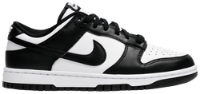

# Premium Custom Image Display Code Database

This file contains the complete, self-contained HTML and CSS code snippets for all **14 Premium Image Displays** featured in the interactive showcase. Each display is numbered to match the UI labels in the application.

---

## Table of Contents
1. [Effect #1: 3D Parallax Tilt](#effect-1-3d-parallax-tilt)
2. [Effect #2: Conic Glow Border](#effect-2-conic-glow-border)
3. [Effect #3: Light Leak Vignette](#effect-3-light-leak-vignette)
4. [Effect #4: Continuous Ken Burns Pan](#effect-4-continuous-ken-burns-pan)
5. [Effect #5: Dynamic Shuffle Grid](#effect-5-dynamic-shuffle-grid)
6. [Effect #6: Interactive Accordion Panels](#effect-6-interactive-accordion-panels)
7. [Effect #7: 3D Cover Flow Carousel](#effect-7-3d-cover-flow-carousel)
8. [Effect #8: Circular 3D Gallery](#effect-8-circular-3d-gallery)
9. [Effect #9: Infinite 3D Wave Gallery](#effect-9-infinite-3d-wave-gallery)
10. [Effect #10: Interactive Fanned Deck](#effect-10-interactive-fanned-deck)
11. [Effect #11: Pixel Image](#effect-11-pixel-image)
12. [Effect #12: 3D Sneaker Rotator](#effect-12-3d-sneaker-rotator)
13. [Effect #13: 3D Rotating Carousel](#effect-13-3d-rotating-carousel)
14. [Effect #14: Sticky Grid Scroll](#effect-14-sticky-grid-scroll)

---

## Effect #1: 3D Parallax Tilt
*Interactive perspective tilt with a floating badge that gains depth on hover.*

### HTML
```html
<div class="img-box-1">
    <div class="card-3d-1">
        
        <div class="badge-1">Alpine Peak</div>
    </div>
</div>
```

### CSS
```css
.img-box-1 {
    perspective: 1000px;
    width: 100%;
    height: 100%;
    display: flex;
    align-items: center;
    justify-content: center;
}

.img-box-1 .card-3d-1 {
    position: relative;
    width: 100%;
    height: 100%;
    border-radius: 12px;
    transform-style: preserve-3d;
    transition: transform 0.5s cubic-bezier(0.25, 1, 0.5, 1);
    overflow: hidden;
}

.img-box-1:hover .card-3d-1 {
    transform: rotateX(10deg) rotateY(-10deg);
}

.img-box-1 .img-1 {
    width: 100%;
    height: 100%;
    object-fit: cover;
    transform: scale(1.05);
    transition: transform 0.5s ease;
}

.img-box-1:hover .img-1 {
    transform: scale(1.12);
}

.img-box-1 .badge-1 {
    position: absolute;
    bottom: 20px;
    left: 20px;
    background: rgba(18, 24, 38, 0.7);
    backdrop-filter: blur(8px);
    -webkit-backdrop-filter: blur(8px);
    border: 1px solid rgba(255, 255, 255, 0.15);
    color: #fff;
    padding: 6px 14px;
    border-radius: 6px;
    font-weight: 500;
    font-size: 0.85rem;
    transform: translateZ(20px);
    transition: transform 0.5s ease, background 0.3s, border-color 0.3s;
}

.img-box-1:hover .badge-1 {
    transform: translateZ(40px) translateY(-5px);
    background: rgba(99, 102, 241, 0.25);
    border-color: #6366f1;
}
```

---

## Effect #2: Conic Glow Border
*Shimmering multi-colored border animation that accelerates on card hover.*

### HTML
```html
<div class="img-box-2">
    <div class="shimmer-border-2"></div>
    <div class="inner-frame-2">
        
    </div>
</div>
```

### CSS
```css
.img-box-2 {
    position: relative;
    width: 100%;
    height: 100%;
    border-radius: 14px;
    overflow: hidden;
    padding: 3px;
    background: transparent;
    display: flex;
    align-items: center;
    justify-content: center;
}

.img-box-2 .shimmer-border-2 {
    position: absolute;
    top: -150%;
    left: -150%;
    width: 400%;
    height: 400%;
    background: conic-gradient(
        from 90deg at 50% 50%,
        #6366f1 0%,
        #ec4899 25%,
        #3b82f6 50%,
        #10b981 75%,
        #6366f1 100%
    );
    animation: conic-spin-2 4s linear infinite;
    z-index: 1;
}

.img-box-2:hover .shimmer-border-2 {
    animation-duration: 2s;
}

.img-box-2 .inner-frame-2 {
    position: relative;
    width: 100%;
    height: 100%;
    border-radius: 11px;
    overflow: hidden;
    z-index: 2;
    background: #0a0e17;
}

.img-box-2 img {
    width: 100%;
    height: 100%;
    object-fit: cover;
    transition: transform 0.6s cubic-bezier(0.25, 1, 0.5, 1);
}

.img-box-2:hover img {
    transform: scale(1.1);
}

@keyframes conic-spin-2 {
    from { transform: rotate(0deg); }
    to { transform: rotate(360deg); }
}
```

---

## Effect #3: Light Leak Vignette
*Cosmic aurora borealis color gradient vignette overlays that shift position and scale on hover.*

### HTML
```html
<div class="img-box img-box-3">
    
    <div class="leak-3"></div>
    <div class="caption-3">Aurora Borealis</div>
</div>
```

### CSS
```css
.img-box-3 {
    position: relative;
    width: 100%;
    height: 100%;
    border-radius: 12px;
    overflow: hidden;
}

.img-box-3 .img-3 {
    width: 100%;
    height: 100%;
    object-fit: cover;
    filter: brightness(0.6) contrast(1.15);
    transition: transform 0.7s cubic-bezier(0.25, 1, 0.5, 1), filter 0.7s;
}

.img-box-3 .leak-3 {
    position: absolute;
    top: 0;
    left: 0;
    right: 0;
    bottom: 0;
    background: radial-gradient(
        circle at 0% 0%,
        rgba(0, 240, 255, 0.35) 0%,
        rgba(236, 72, 153, 0.25) 40%,
        transparent 80%
    );
    mix-blend-mode: screen;
    opacity: 0.5;
    transition: opacity 0.7s ease, background 0.7s ease;
    pointer-events: none;
    z-index: 2;
}

.img-box-3:hover .img-3 {
    transform: scale(1.1);
    filter: brightness(0.95) contrast(1.2);
}

.img-box-3:hover .leak-3 {
    opacity: 0.9;
    background: radial-gradient(
        circle at 100% 100%,
        rgba(0, 240, 255, 0.4) 0%,
        rgba(139, 92, 246, 0.3) 50%,
        transparent 90%
    );
}

.img-box-3 .caption-3 {
    position: absolute;
    bottom: -50px;
    left: 0;
    right: 0;
    background: linear-gradient(transparent, rgba(10, 14, 23, 0.9) 80%);
    padding: 25px 15px 15px;
    color: #fff;
    font-weight: 500;
    font-size: 0.95rem;
    text-align: center;
    transition: bottom 0.5s cubic-bezier(0.25, 1, 0.5, 1);
    z-index: 3;
    letter-spacing: 0.5px;
}

.img-box-3:hover .caption-3 {
    bottom: 0;
}
```

---

## Effect #4: Continuous Ken Burns Pan
*Continuous diagonal panning and zooming simulation mimicking cinematic camera movements.*

### HTML
```html
<div class="img-box img-box-4">
    
    <span class="badge-4">Ken Burns</span>
</div>
```

### CSS
```css
.img-box-4 {
    position: relative;
    width: 100%;
    height: 100%;
    border-radius: 12px;
    overflow: hidden;
}

.img-box-4 .img-kb-4 {
    width: 100%;
    height: 100%;
    object-fit: cover;
    transform: scale(1) translate(0, 0);
    transition: transform 0.6s ease;
}

.img-box-4:hover .img-kb-4 {
    animation: pan-zoom-4 10s ease-in-out infinite alternate;
}

@keyframes pan-zoom-4 {
    0% {
        transform: scale(1) translate(0, 0);
    }
    50% {
        transform: scale(1.22) translate(-4%, -2%);
    }
    100% {
        transform: scale(1.15) translate(3%, 3%);
    }
}

.img-box-4 .badge-4 {
    position: absolute;
    top: 15px;
    left: 15px;
    background: rgba(16, 185, 129, 0.2);
    border: 1px solid rgba(16, 185, 129, 0.4);
    color: #34d399;
    font-size: 0.75rem;
    font-family: var(--font-mono);
    padding: 4px 8px;
    border-radius: 4px;
    pointer-events: none;
    letter-spacing: 0.5px;
}
```

---

## Effect #5: Dynamic Shuffle Grid
*Interactive 4x4 grid of images that dynamically shuffles cell positions upon hover.*

### HTML
```html
<div class="shuffle-grid-wrap">
    <div class="shuffle-grid-container" id="shuffle-grid-5">
        <div class="shuffle-cell" style="background-image: url('https://images.unsplash.com/photo-1547347298-4074fc3086f0?auto=format&fit=crop&w=150&q=80')"></div>
        <div class="shuffle-cell" style="background-image: url('https://images.unsplash.com/photo-1510925758641-869d353cecc7?auto=format&fit=crop&w=150&q=80')"></div>
        <div class="shuffle-cell" style="background-image: url('https://images.unsplash.com/photo-1629901925121-8a141c2a42f4?auto=format&fit=crop&w=150&q=80')"></div>
        <div class="shuffle-cell" style="background-image: url('https://images.unsplash.com/photo-1507525428034-b723cf961d3e?auto=format&fit=crop&w=150&q=80')"></div>
        <div class="shuffle-cell" style="background-image: url('https://images.unsplash.com/photo-1464983953574-0892a716854b?auto=format&fit=crop&w=150&q=80')"></div>
        <div class="shuffle-cell" style="background-image: url('https://images.unsplash.com/photo-1506744038136-46273834b3fb?auto=format&fit=crop&w=150&q=80')"></div>
        <div class="shuffle-cell" style="background-image: url('https://images.unsplash.com/photo-1502082553048-f009c37129b9?auto=format&fit=crop&w=150&q=80')"></div>
        <div class="shuffle-cell" style="background-image: url('https://images.unsplash.com/photo-1470770841072-f978cf4d019e?auto=format&fit=crop&w=150&q=80')"></div>
        <div class="shuffle-cell" style="background-image: url('https://images.unsplash.com/photo-1447752875215-b2761acb3c5d?auto=format&fit=crop&w=150&q=80')"></div>
        <div class="shuffle-cell" style="background-image: url('https://images.unsplash.com/photo-1472214222541-d510753a4907?auto=format&fit=crop&w=150&q=80')"></div>
        <div class="shuffle-cell" style="background-image: url('https://images.unsplash.com/photo-1501854140801-50d01698950b?auto=format&fit=crop&w=150&q=80')"></div>
        <div class="shuffle-cell" style="background-image: url('https://images.unsplash.com/photo-1469474968028-56623f02e42e?auto=format&fit=crop&w=150&q=80')"></div>
        <div class="shuffle-cell" style="background-image: url('https://images.unsplash.com/photo-1513836279014-a89f7a76ae86?auto=format&fit=crop&w=150&q=80')"></div>
        <div class="shuffle-cell" style="background-image: url('https://images.unsplash.com/photo-1441974231531-c6227db76b6e?auto=format&fit=crop&w=150&q=80')"></div>
        <div class="shuffle-cell" style="background-image: url('https://images.unsplash.com/photo-1527549993586-dff825b37782?auto=format&fit=crop&w=150&q=80')"></div>
        <div class="shuffle-cell" style="background-image: url('https://images.unsplash.com/photo-1533105079780-92b9be482077?auto=format&fit=crop&w=150&q=80')"></div>
    </div>
</div>
```

### CSS
```css
.shuffle-grid-wrap {
    width: 100%;
    height: 100%;
    display: flex;
    align-items: center;
    justify-content: center;
    background-color: #0c101b;
    border-radius: 12px;
    padding: 8px;
}
.shuffle-grid-container {
    display: grid;
    grid-template-columns: repeat(4, 1fr);
    grid-template-rows: repeat(4, 1fr);
    gap: 4px;
    width: 100%;
    height: 100%;
    max-height: 220px;
}
.shuffle-cell {
    width: 100%;
    height: 100%;
    border-radius: 4px;
    background-size: cover;
    background-position: center;
    background-color: var(--bg-card);
    transition: transform 0.6s cubic-bezier(0.25, 0.8, 0.25, 1), opacity 0.4s;
}
```

---

## Effect #6: Interactive Accordion Panels
*Five vertical image panels that smoothly expand and contract dynamically upon click.*

### HTML
```html
<div class="accordion-panel-wrap">
    <div class="accordion-container" id="accordion-container-6">
        <div class="accordion-option active" style="background-image: url('https://images.unsplash.com/photo-1506744038136-46273834b3fb?auto=format&fit=crop&w=600&q=80')">
            <div class="accordion-shadow"></div>
            <div class="accordion-label">
                <div class="accordion-icon">🏕️</div>
                <div class="accordion-info">
                    <div class="accordion-main">Luxury Tent</div>
                    <div class="accordion-sub">Cozy glamping under the stars</div>
                </div>
            </div>
        </div>
        <div class="accordion-option" style="background-image: url('https://images.unsplash.com/photo-1464983953574-0892a716854b?auto=format&fit=crop&w=600&q=80')">
            <div class="accordion-shadow"></div>
            <div class="accordion-label">
                <div class="accordion-icon">🔥</div>
                <div class="accordion-info">
                    <div class="accordion-main">Campfire Feast</div>
                    <div class="accordion-sub">Gourmet s'mores & stories</div>
                </div>
            </div>
        </div>
        <div class="accordion-option" style="background-image: url('https://images.unsplash.com/photo-1507525428034-b723cf961d3e?auto=format&fit=crop&w=600&q=80')">
            <div class="accordion-shadow"></div>
            <div class="accordion-label">
                <div class="accordion-icon">💧</div>
                <div class="accordion-info">
                    <div class="accordion-main">Lakeside Retreat</div>
                    <div class="accordion-sub">Private dock & canoe rides</div>
                </div>
            </div>
        </div>
        <div class="accordion-option" style="background-image: url('https://images.unsplash.com/photo-1502082553048-f009c37129b9?auto=format&fit=crop&w=600&q=80')">
            <div class="accordion-shadow"></div>
            <div class="accordion-label">
                <div class="accordion-icon">♨️</div>
                <div class="accordion-info">
                    <div class="accordion-main">Mountain Spa</div>
                    <div class="accordion-sub">Outdoor sauna & hot tub</div>
                </div>
            </div>
        </div>
        <div class="accordion-option" style="background-image: url('https://images.unsplash.com/photo-1470770841072-f978cf4d019e?auto=format&fit=crop&w=600&q=80')">
            <div class="accordion-shadow"></div>
            <div class="accordion-label">
                <div class="accordion-icon">🥾</div>
                <div class="accordion-info">
                    <div class="accordion-main">Guided Adventure</div>
                    <div class="accordion-sub">Expert-led nature tours</div>
                </div>
            </div>
        </div>
    </div>
</div>
```

### CSS
```css
.accordion-panel-wrap {
    width: 100%;
    height: 100%;
    display: flex;
    align-items: center;
    justify-content: center;
    background-color: #121826;
    border-radius: 12px;
    overflow: hidden;
    padding: 0.5rem;
}
.accordion-container {
    display: flex;
    width: 100%;
    height: 100%;
    max-height: 220px;
    gap: 0.5rem;
    align-items: stretch;
}
.accordion-option {
    position: relative;
    flex: 1;
    min-width: 44px;
    height: 100%;
    border-radius: 8px;
    cursor: pointer;
    overflow: hidden;
    background-size: cover;
    background-position: center;
    border: 1px solid rgba(255, 255, 255, 0.1);
    transition: flex 0.6s cubic-bezier(0.25, 0.8, 0.25, 1), border-color 0.4s;
    box-shadow: 0 4px 15px rgba(0, 0, 0, 0.3);
}
.accordion-option.active {
    flex: 5;
    border-color: rgba(99, 102, 241, 0.6);
    box-shadow: 0 8px 25px rgba(0, 0, 0, 0.5);
}
.accordion-shadow {
    position: absolute;
    top: 0;
    left: 0;
    right: 0;
    bottom: 0;
    background: linear-gradient(to top, rgba(0, 0, 0, 0.8) 0%, rgba(0, 0, 0, 0) 50%);
    pointer-events: none;
    z-index: 1;
}
.accordion-label {
    position: absolute;
    left: 10px;
    bottom: 10px;
    display: flex;
    align-items: center;
    gap: 8px;
    z-index: 2;
    pointer-events: none;
}
.accordion-icon {
    width: 32px;
    height: 32px;
    border-radius: 50%;
    background: rgba(255, 255, 255, 0.2);
    backdrop-filter: blur(4px);
    display: flex;
    align-items: center;
    justify-content: center;
    color: #fff;
    font-size: 1.1rem;
    border: 1px solid rgba(255, 255, 255, 0.3);
}
.accordion-info {
    display: flex;
    flex-direction: column;
    overflow: hidden;
    white-space: nowrap;
}
.accordion-main {
    color: #fff;
    font-weight: 600;
    font-size: 0.9rem;
    opacity: 0;
    transform: translateX(20px);
    transition: opacity 0.4s 0.2s, transform 0.4s 0.2s;
}
.accordion-sub {
    color: rgba(255, 255, 255, 0.7);
    font-size: 0.75rem;
    opacity: 0;
    transform: translateX(20px);
    transition: opacity 0.4s 0.3s, transform 0.4s 0.3s;
}
.accordion-option.active .accordion-main,
.accordion-option.active .accordion-sub {
    opacity: 1;
    transform: translateX(0);
}
```

---

## Effect #7: 3D Cover Flow Carousel
*Interactive 3D Carousel with forward/backward controls, depth, and scale transition animations.*

### HTML
```html
<div class="coverflow-wrap">
    <div class="coverflow-container" id="coverflow-container-7">
        <button class="coverflow-btn prev" id="coverflow-prev-7">❮</button>
        <div class="coverflow-slides">
            <div class="coverflow-slide" style="background-image: url('https://images.unsplash.com/photo-1464822759023-fed622ff2c3b?auto=format&fit=crop&w=600&q=80')"></div>
            <div class="coverflow-slide" style="background-image: url('https://images.unsplash.com/photo-1505118380757-91f5f5632de0?auto=format&fit=crop&w=600&q=80')"></div>
            <div class="coverflow-slide" style="background-image: url('https://images.unsplash.com/photo-1531366936337-7c912a4589a7?auto=format&fit=crop&w=600&q=80')"></div>
            <div class="coverflow-slide" style="background-image: url('https://images.unsplash.com/photo-1600585154340-be6161a56a0c?auto=format&fit=crop&w=600&q=80')"></div>
            <div class="coverflow-slide" style="background-image: url('https://images.unsplash.com/photo-1501854140801-50d01698950b?auto=format&fit=crop&w=600&q=80')"></div>
        </div>
        <button class="coverflow-btn next" id="coverflow-next-7">❯</button>
    </div>
</div>
```

### CSS
```css
.coverflow-wrap {
    width: 100%;
    height: 100%;
    position: relative;
    display: flex;
    align-items: center;
    justify-content: center;
    background-color: #0c0f17;
    overflow: hidden;
    border-radius: 12px;
    padding: 1rem;
}
.coverflow-container {
    position: relative;
    width: 100%;
    height: 220px;
    display: flex;
    align-items: center;
    justify-content: center;
    perspective: 1000px;
}
.coverflow-slides {
    position: relative;
    width: 120px;
    height: 180px;
    transform-style: preserve-3d;
    display: flex;
    align-items: center;
    justify-content: center;
}
.coverflow-slide {
    position: absolute;
    width: 100%;
    height: 100%;
    background-size: cover;
    background-position: center;
    border-radius: 16px;
    border: 1.5px solid rgba(255, 255, 255, 0.08);
    box-shadow: 0 15px 35px rgba(0, 0, 0, 0.5);
    transition: all 0.5s ease-in-out;
    will-change: transform, opacity, filter, z-index;
}
.coverflow-btn {
    position: absolute;
    top: 50%;
    transform: translateY(-50%);
    width: 32px;
    height: 32px;
    border-radius: 50%;
    background: rgba(24, 32, 50, 0.6);
    backdrop-filter: blur(4px);
    border: 1px solid rgba(255, 255, 255, 0.15);
    color: #fff;
    display: flex;
    align-items: center;
    justify-content: center;
    cursor: pointer;
    z-index: 10;
    font-size: 0.85rem;
    transition: background 0.3s, transform 0.3s;
}
.coverflow-btn:hover {
    background: rgba(99, 102, 241, 0.8);
    transform: translateY(-50%) scale(1.1);
}
.coverflow-btn.prev {
    left: 10px;
}
.coverflow-btn.next {
    right: 10px;
}
```

---

## Effect #8: Circular 3D Gallery
*A 3D circular carousel of images rotating around the Y-axis, supporting automatic rotation and window scroll-bound manual rotation controls.*

### HTML
```html
<div class="circular-gallery-wrap">
    <div class="circular-gallery-container" id="circular-gallery-container-8">
        <div class="circular-gallery-carousel">
            <div class="circular-gallery-item">
                <div class="circular-gallery-card">
                    
                    <div class="circular-gallery-info">
                        <h3>Mist Forest</h3>
                        <p>Pinus sylvestris</p>
                    </div>
                </div>
            </div>
            <div class="circular-gallery-item">
                <div class="circular-gallery-card">
                    
                    <div class="circular-gallery-info">
                        <h3>Sunbeams</h3>
                        <p>Fagus sylvatica</p>
                    </div>
                </div>
            </div>
            <div class="circular-gallery-item">
                <div class="circular-gallery-card">
                    
                    <div class="circular-gallery-info">
                        <h3>Green Meadow</h3>
                        <p>Poaceae pratensis</p>
                    </div>
                </div>
            </div>
            <div class="circular-gallery-item">
                <div class="circular-gallery-card">
                    
                    <div class="circular-gallery-info">
                        <h3>Mountain Peak</h3>
                        <p>Alpine elevations</p>
                    </div>
                </div>
            </div>
            <div class="circular-gallery-item">
                <div class="circular-gallery-card">
                    
                    <div class="circular-gallery-info">
                        <h3>Alpine Valley</h3>
                        <p>Ranunculus acris</p>
                    </div>
                </div>
            </div>
            <div class="circular-gallery-item">
                <div class="circular-gallery-card">
                    
                    <div class="circular-gallery-info">
                        <h3>Lakeside Glamping</h3>
                        <p>Camping luxury</p>
                    </div>
                </div>
            </div>
        </div>
    </div>
</div>
```

### CSS
```css
.circular-gallery-wrap {
    width: 100%;
    height: 100%;
    position: relative;
    display: flex;
    align-items: center;
    justify-content: center;
    background-color: #0c0f17;
    overflow: hidden;
    border-radius: 12px;
    padding: 1rem;
}
.circular-gallery-container {
    position: relative;
    width: 100%;
    height: 220px;
    display: flex;
    align-items: center;
    justify-content: center;
    perspective: 2000px;
}
.circular-gallery-carousel {
    position: relative;
    width: 100%;
    height: 100%;
    transform-style: preserve-3d;
    display: flex;
    align-items: center;
    justify-content: center;
    will-change: transform;
}
.circular-gallery-item {
    position: absolute;
    width: 90px;
    height: 125px;
    transform-style: preserve-3d;
    left: 50%;
    top: 50%;
    margin-left: -45px;
    margin-top: -62.5px;
    transition: opacity 0.3s linear;
    will-change: transform, opacity;
}
.circular-gallery-card {
    position: relative;
    width: 100%;
    height: 100%;
    border-radius: 10px;
    overflow: hidden;
    border: 1px solid rgba(255, 255, 255, 0.08);
    background-color: rgba(24, 32, 50, 0.5);
    box-shadow: 0 10px 25px rgba(0, 0, 0, 0.5);
    backdrop-filter: blur(8px);
}
.circular-gallery-card img {
    position: absolute;
    inset: 0;
    width: 100%;
    height: 100%;
    object-fit: cover;
}
.circular-gallery-info {
    position: absolute;
    bottom: 0;
    left: 0;
    width: 100%;
    padding: 8px;
    background: linear-gradient(to top, rgba(0, 0, 0, 0.8) 0%, transparent 100%);
    color: #fff;
    pointer-events: none;
}
.circular-gallery-info h3 {
    margin: 0;
    font-size: 0.65rem;
    font-weight: 700;
    white-space: nowrap;
    overflow: hidden;
    text-overflow: ellipsis;
}
.circular-gallery-info p {
    margin: 2px 0 0;
    font-size: 0.5rem;
    opacity: 0.8;
    font-style: italic;
    white-space: nowrap;
    overflow: hidden;
    text-overflow: ellipsis;
}
```

---

## Effect #9: Infinite 3D Wave Gallery
*A 3D image gallery rendered on canvas using Three.js with custom GLSL shaders. Simulates realistic cloth wave physics on hover, responds to manual scroll wheel momentum, and features smooth auto-scrolling depth fades/blurs.*

### HTML
```html
<div class="wave-gallery-wrap">
    <!-- Note: This premium effect requires Three.js loaded from CDN:
    <script src="https://cdnjs.cloudflare.com/ajax/libs/three.js/r128/three.min.js"></script> -->
    <div class="wave-gallery-container" id="wave-gallery-container-9"></div>
</div>
```

### CSS
```css
.wave-gallery-wrap {
    width: 100%;
    height: 100%;
    position: relative;
    background-color: #05070c;
    overflow: hidden;
    border-radius: 12px;
}
.wave-gallery-container {
    width: 100%;
    height: 220px;
    position: relative;
    outline: none;
}
.wave-gallery-container canvas {
    display: block;
    width: 100%;
    height: 100%;
}
```

---

## Effect #10: Interactive Fanned Deck
*A fanned card layout that dynamically expands and pushes adjacent cards to the left or right when hovered, utilizing GSAP for elastic animations and responsive scaling.*

### HTML
```html
<div class="fanned-deck-wrap">
    <!-- Note: This premium effect requires GSAP loaded from CDN:
    <script src="https://cdnjs.cloudflare.com/ajax/libs/gsap/3.12.2/gsap.min.js"></script> -->
    <div class="fanned-deck-container" id="fanned-deck-container-10">
        <div class="fan-layout">
            <div class="fan-card">
                <div class="relative w-full h-full overflow-hidden">
                    
                </div>
            </div>
            <div class="fan-card">
                <div class="relative w-full h-full overflow-hidden">
                    
                </div>
            </div>
            <div class="fan-card">
                <div class="relative w-full h-full overflow-hidden">
                    
                </div>
            </div>
            <div class="fan-card">
                <div class="relative w-full h-full overflow-hidden">
                    
                </div>
            </div>
            <div class="fan-card">
                <div class="relative w-full h-full overflow-hidden">
                    
                </div>
            </div>
            <div class="fan-card">
                <div class="relative w-full h-full overflow-hidden">
                    
                </div>
            </div>
            <div class="fan-card">
                <div class="relative w-full h-full overflow-hidden">
                    
                </div>
            </div>
            <div class="fan-card">
                <div class="relative w-full h-full overflow-hidden">
                    
                </div>
            </div>
        </div>
        <button class="fanned-deck-btn prev" id="fanned-deck-prev-10">❮</button>
        <button class="fanned-deck-btn next" id="fanned-deck-next-10">❯</button>
        <div class="fanned-deck-pagination"></div>
    </div>
</div>
```

### CSS
```css
.fanned-deck-wrap {
    width: 100%;
    height: 100%;
    position: relative;
    display: flex;
    align-items: center;
    justify-content: center;
    background-color: #0c0f17;
    overflow: hidden;
    border-radius: 12px;
    padding: 1rem;
}
.fanned-deck-container {
    position: relative;
    width: 100%;
    height: 220px;
    display: flex;
    align-items: center;
    justify-content: center;
}
.fan-layout {
    position: relative;
    width: 100%;
    height: 100%;
    display: flex;
    align-items: center;
    justify-content: center;
}
.fan-card {
    position: absolute;
    width: 75px;
    height: 105px;
    border-radius: 8px;
    background-color: #1a2333;
    border: 1px solid rgba(255, 255, 255, 0.12);
    box-shadow: 0 10px 25px rgba(0, 0, 0, 0.4);
    will-change: transform, opacity;
    cursor: pointer;
    overflow: hidden;
}
.fan-card img {
    width: 100%;
    height: 100%;
    object-fit: cover;
}
.fanned-deck-btn {
    position: absolute;
    top: 50%;
    transform: translateY(-50%);
    width: 32px;
    height: 32px;
    border-radius: 50%;
    background: rgba(24, 32, 50, 0.6);
    backdrop-filter: blur(4px);
    border: 1px solid rgba(255, 255, 255, 0.15);
    color: #fff;
    display: flex;
    align-items: center;
    justify-content: center;
    cursor: pointer;
    z-index: 20;
    font-size: 0.85rem;
    transition: background 0.3s, transform 0.3s;
}
.fanned-deck-btn:hover {
    background: rgba(99, 102, 241, 0.8);
    transform: translateY(-50%) scale(1.1);
}
.fanned-deck-btn.prev {
    left: 10px;
}
.fanned-deck-btn.next {
    right: 10px;
}
.fanned-deck-pagination {
    position: absolute;
    bottom: 10px;
    left: 50%;
    transform: translateX(-50%);
    display: flex;
    align-items: center;
    gap: 6px;
    z-index: 30;
}
.fanned-deck-dot {
    width: 6px;
    height: 6px;
    border-radius: 50%;
    background-color: rgba(255, 255, 255, 0.2);
    transition: all 0.3s ease;
}
.fanned-deck-dot.active {
    background-color: rgba(255, 255, 255, 0.8);
    transform: scale(1.3);
}
```

---

## Effect #11: Pixel Image
*A decorative image reveal component that fades in image pieces in a pixelated grid pattern with grayscale-to-color transition. Click to replay.*

### HTML
```html
<div class="pixel-image-container" id="pixel-image-11"></div>
```

### CSS
```css
.pixel-image-container {
    position: relative;
    width: 220px;
    height: 220px;
    user-select: none;
    cursor: pointer;
    border-radius: 20px;
    overflow: hidden;
    background-color: #060913;
}

.pixel-image-container .pixel-piece {
    position: absolute;
    inset: 0;
    opacity: 0;
    transition-property: opacity;
    transition-timing-function: ease-out;
}

.pixel-image-container .pixel-piece.visible {
    opacity: 1;
}

.pixel-image-container .pixel-piece-img {
    position: absolute;
    inset: 0;
    width: 100%;
    height: 100%;
    object-fit: cover;
    border-radius: inherit;
}

.pixel-image-container .pixel-piece-img.grayscale {
    filter: grayscale(100%);
}
```

### JavaScript
```javascript
(function() {
    const container = document.getElementById('pixel-image-11');
    if (!container) return;

    const src = "https://images.unsplash.com/photo-1470071459604-3b5ec3a7fe05?auto=format&fit=crop&w=600&q=80"; // Beautiful mist forest image
    const rows = 6;
    const cols = 8;
    const pixelFadeInDuration = 1000;
    const maxAnimationDelay = 1200;
    const colorRevealDelay = 1300;

    const total = rows * cols;
    container.innerHTML = ''; // Clear container

    // Generate pieces array
    const pieces = Array.from({ length: total }, (_, index) => {
        const row = Math.floor(index / cols);
        const col = index % cols;
        const clipPath = `polygon(
            ${col * (100 / cols)}% ${row * (100 / rows)}%,
            ${(col + 1) * (100 / cols)}% ${row * (100 / rows)}%,
            ${(col + 1) * (100 / cols)}% ${(row + 1) * (100 / rows)}%,
            ${col * (100 / cols)}% ${(row + 1) * (100 / rows)}%
        )`;
        const delay = Math.random() * maxAnimationDelay;
        return { clipPath, delay };
    });

    // Create DOM elements
    pieces.forEach((piece, index) => {
        const pieceDiv = document.createElement('div');
        pieceDiv.className = 'pixel-piece';
        pieceDiv.style.clipPath = piece.clipPath;
        pieceDiv.style.transitionDelay = `${piece.delay}ms`;
        pieceDiv.style.transitionDuration = `${pixelFadeInDuration}ms`;

        const img = document.createElement('img');
        img.src = src;
        img.alt = `Pixel image piece ${index + 1}`;
        img.className = 'pixel-piece-img grayscale';
        img.draggable = false;
        img.style.transition = `filter ${pixelFadeInDuration}ms cubic-bezier(0.4, 0, 0.2, 1)`;

        pieceDiv.appendChild(img);
        container.appendChild(pieceDiv);
    });

    // Trigger animation on next frame
    requestAnimationFrame(() => {
        container.querySelectorAll('.pixel-piece').forEach(p => p.classList.add('visible'));
    });

    // Trigger color reveal
    const colorTimeout = setTimeout(() => {
        container.querySelectorAll('.pixel-piece-img').forEach(img => img.classList.remove('grayscale'));
    }, colorRevealDelay);

    // Replay helper on click
    const replay = () => {
        clearTimeout(colorTimeout);
        container.querySelectorAll('.pixel-piece').forEach(p => p.classList.remove('visible'));
        container.querySelectorAll('.pixel-piece-img').forEach(img => img.classList.add('grayscale'));

        setTimeout(() => {
            container.querySelectorAll('.pixel-piece').forEach(p => p.classList.add('visible'));
            setTimeout(() => {
                container.querySelectorAll('.pixel-piece-img').forEach(img => img.classList.remove('grayscale'));
            }, colorRevealDelay);
        }, 100);
    };

    container.addEventListener('click', replay);
})();
```

### React/Next.js (Source Component)
```tsx
import { useEffect, useMemo, useState } from "react";

type Grid = {
  rows: number;
  cols: number;
};

const DEFAULT_GRIDS: Record<string, Grid> = {
  "6x4": { rows: 4, cols: 6 },
  "8x8": { rows: 8, cols: 8 },
  "8x3": { rows: 3, cols: 8 },
  "4x6": { rows: 6, cols: 4 },
  "3x8": { rows: 8, cols: 3 },
};

type PredefinedGridKey = keyof typeof DEFAULT_GRIDS;

interface PixelImageProps {
  src: string;
  grid?: PredefinedGridKey;
  customGrid?: Grid;
  grayscaleAnimation?: boolean;
  pixelFadeInDuration?: number; // in ms
  maxAnimationDelay?: number; // in ms
  colorRevealDelay?: number; // in ms
}

export const PixelImage = ({
  src,
  grid = "6x4",
  grayscaleAnimation = true,
  pixelFadeInDuration = 1000,
  maxAnimationDelay = 1200,
  colorRevealDelay = 1300,
  customGrid,
}: PixelImageProps) => {
  const [isVisible, setIsVisible] = useState(false);
  const [showColor, setShowColor] = useState(false);

  const MIN_GRID = 1;
  const MAX_GRID = 16;

  const { rows, cols } = useMemo(() => {
    const isValidGrid = (grid?: Grid) => {
      if (!grid) return false;
      const { rows, cols } = grid;
      return (
        Number.isInteger(rows) &&
        Number.isInteger(cols) &&
        rows >= MIN_GRID &&
        cols >= MIN_GRID &&
        rows <= MAX_GRID &&
        cols <= MAX_GRID
      );
    };

    return isValidGrid(customGrid) ? customGrid! : DEFAULT_GRIDS[grid];
  }, [customGrid, grid]);

  useEffect(() => {
    setIsVisible(true);
    const colorTimeout = setTimeout(() => {
      setShowColor(true);
    }, colorRevealDelay);
    return () => clearTimeout(colorTimeout);
  }, [colorRevealDelay]);

  const pieces = useMemo(() => {
    const total = rows * cols;
    return Array.from({ length: total }, (_, index) => {
      const row = Math.floor(index / cols);
      const col = index % cols;

      const clipPath = `polygon(
        ${col * (100 / cols)}% ${row * (100 / rows)}%,
        ${(col + 1) * (100 / cols)}% ${row * (100 / rows)}%,
        ${(col + 1) * (100 / cols)}% ${(row + 1) * (100 / rows)}%,
        ${col * (100 / cols)}% ${(row + 1) * (100 / rows)}%
      )`;

      const delay = Math.random() * maxAnimationDelay;
      return {
        clipPath,
        delay,
      };
    });
  }, [rows, cols, maxAnimationDelay]);

  return (
    <div className="relative h-72 w-72 select-none md:h-96 md:w-96">
      {pieces.map((piece, index) => (
        <div
          key={index}
          className={`absolute inset-0 transition-all ease-out ${
            isVisible ? "opacity-100" : "opacity-0"
          }`}
          style={{
            clipPath: piece.clipPath,
            transitionDelay: `${piece.delay}ms`,
            transitionDuration: `${pixelFadeInDuration}ms`,
          }}
        >
          
        </div>
      ))}
    </div>
  );
};
```

---

## Effect #12: 3D Sneaker Rotator
*An interactive 3D product view display using pre-rendered sneaker rotation frames from the MatthewGreenberg/shoe-finder repository. Responsive to mouse movement and drag.*

### HTML
```html
<div class="shoe-rotator-wrap">
    <div class="shoe-rotator-container" id="shoe-rotator-12">
        <div class="shoe-loader" id="shoe-loader-12">Loading 3D Model...</div>
        
        <div class="shoe-hint">Drag or hover to rotate 360°</div>
    </div>
</div>
```

### CSS
```css
.shoe-rotator-wrap {
    width: 100%;
    height: 100%;
    display: flex;
    align-items: center;
    justify-content: center;
    background: radial-gradient(circle at center, #1e293b 0%, #0f172a 100%);
    border-radius: 12px;
    overflow: hidden;
    position: relative;
}

.shoe-rotator-container {
    width: 100%;
    height: 100%;
    position: relative;
    display: flex;
    align-items: center;
    justify-content: center;
    cursor: ew-resize;
    user-select: none;
}

.shoe-rotator-container img {
    max-width: 90%;
    max-height: 90%;
    object-fit: contain;
    pointer-events: none;
    transition: transform 0.1s ease-out;
}

.shoe-rotator-container:hover img {
    transform: scale(1.05);
}

.shoe-loader {
    position: absolute;
    font-size: 0.8rem;
    color: var(--text-secondary);
    font-family: var(--font-mono);
}

.shoe-hint {
    position: absolute;
    bottom: 12px;
    font-size: 0.75rem;
    color: var(--text-secondary);
    background: rgba(15, 23, 42, 0.6);
    padding: 4px 8px;
    border-radius: 4px;
    backdrop-filter: blur(4px);
    pointer-events: none;
    opacity: 0.8;
    transition: opacity 0.3s;
}

.shoe-rotator-container:hover .shoe-hint {
    opacity: 0;
}
```

### JavaScript
```javascript
(function() {
    const container = document.getElementById('shoe-rotator-12');
    const img = document.getElementById('shoe-img-12');
    const loader = document.getElementById('shoe-loader-12');
    if (!container || !img) return;

    const totalFrames = 144;
    const basePath = 'shoes/shoe-';
    const images = [];
    let loadedCount = 0;

    for (let i = 0; i < totalFrames; i++) {
        const numStr = String(i).padStart(3, '0');
        const preloadImg = new Image();
        preloadImg.src = `${basePath}${numStr}.png`;
        preloadImg.onload = () => {
            loadedCount++;
            if (loadedCount === totalFrames) {
                if (loader) loader.style.display = 'none';
            }
        };
        images.push(preloadImg);
    }

    let isDragging = false;
    let startX = 0;
    let currentFrame = 0;
    const sensitivity = 5;

    const updateFrame = (deltaX) => {
        const frameOffset = Math.floor(deltaX / sensitivity);
        let targetFrame = (currentFrame + frameOffset) % totalFrames;
        if (targetFrame < 0) targetFrame += totalFrames;
        
        const numStr = String(targetFrame).padStart(3, '0');
        img.src = `${basePath}${numStr}.png`;
    };

    const onStart = (e) => {
        isDragging = true;
        startX = e.clientX || (e.touches && e.touches[0].clientX) || 0;
        e.preventDefault();
    };

    const onMove = (e) => {
        if (!isDragging) return;
        const clientX = e.clientX || (e.touches && e.touches[0].clientX) || 0;
        const deltaX = clientX - startX;
        updateFrame(deltaX);
    };

    const onEnd = (e) => {
        if (!isDragging) return;
        isDragging = false;
        const clientX = e.changedTouches ? e.changedTouches[0].clientX : e.clientX;
        const deltaX = clientX - startX;
        
        const frameOffset = Math.floor(deltaX / sensitivity);
        currentFrame = (currentFrame + frameOffset) % totalFrames;
        if (currentFrame < 0) currentFrame += totalFrames;
    };

    container.addEventListener('mousedown', onStart);
    container.addEventListener('touchstart', onStart, { passive: true });

    window.addEventListener('mousemove', onMove);
    window.addEventListener('touchmove', onMove, { passive: true });

    window.addEventListener('mouseup', onEnd);
    window.addEventListener('touchend', onEnd);

    container.addEventListener('mousemove', (e) => {
        if (isDragging) return;
        const rect = container.getBoundingClientRect();
        const x = e.clientX - rect.left;
        const percent = x / rect.width;
        const frame = Math.floor(percent * totalFrames) % totalFrames;
        const numStr = String(frame).padStart(3, '0');
        img.src = `${basePath}${numStr}.png`;
    });
})();
```

### React/Next.js (Source Component)
```tsx
import React, { useEffect, useRef, useState } from 'react';

export function SneakerRotator() {
  const containerRef = useRef<HTMLDivElement>(null);
  const [currentFrame, setCurrentFrame] = useState(0);
  const [loading, setLoading] = useState(true);
  const [isDragging, setIsDragging] = useState(false);
  const startXRef = useRef(0);
  
  const totalFrames = 144;
  const basePath = 'shoes/shoe-';
  const sensitivity = 5;

  useEffect(() => {
    // Preload images
    let loadedCount = 0;
    const images: HTMLImageElement[] = [];
    for (let i = 0; i < totalFrames; i++) {
      const numStr = String(i).padStart(3, '0');
      const img = new Image();
      img.src = `${basePath}${numStr}.png`;
      img.onload = () => {
        loadedCount++;
        if (loadedCount === totalFrames) {
          setLoading(false);
        }
      };
      images.push(img);
    }
  }, []);

  const handleStart = (clientX: number) => {
    setIsDragging(true);
    startXRef.current = clientX;
  };

  const handleMove = (clientX: number) => {
    if (!isDragging) return;
    const deltaX = clientX - startXRef.current;
    const frameOffset = Math.floor(deltaX / sensitivity);
    let targetFrame = (currentFrame + frameOffset) % totalFrames;
    if (targetFrame < 0) targetFrame += totalFrames;
    setCurrentFrame(targetFrame);
  };

  const handleEnd = () => {
    setIsDragging(false);
  };

  return (
    <div className="relative w-full h-full flex items-center justify-center bg-radial-gradient overflow-hidden">
      <div
        ref={containerRef}
        className="w-full h-full relative flex items-center justify-center cursor-ew-resize select-none"
        onMouseDown={(e) => handleStart(e.clientX)}
        onMouseMove={(e) => handleMove(e.clientX)}
        onMouseUp={handleEnd}
        onMouseLeave={handleEnd}
        onTouchStart={(e) => handleStart(e.touches[0].clientX)}
        onTouchMove={(e) => handleMove(e.touches[0].clientX)}
        onTouchEnd={handleEnd}
      >
        {loading && <div className="absolute text-xs text-gray-400">Loading 3D Model...</div>}
        
        <div className="absolute bottom-3 text-[11px] text-gray-400 bg-slate-900/60 px-2 py-1 rounded backdrop-blur opacity-80 hover:opacity-0 transition-opacity">
          Drag or hover to rotate 360°
        </div>
      </div>
    </div>
  );
}
```

---

## Effect #13: 3D Rotating Carousel
*A 3D image carousel showcasing beautiful jellyfish photos from Unsplash, rotating infinitely around the Y-axis. Implemented entirely in CSS using 3D transforms, CSS custom properties, and trigonometric layout functions.*

### HTML
```html
<div class="scene-13">
    <div class="a3d-13" style="--n: 12">
        
        
        
        
        
        
        
        
        
        
        
        
    </div>
</div>
```

### CSS
```css
.scene-13 {
    width: 100%;
    height: 100%;
    display: grid;
    overflow: hidden;
    perspective: 35em;
    background-color: #0b0f19;
    border-radius: 12px;
    place-content: center;
}

.a3d-13 {
    display: grid;
    place-self: center;
    transform-style: preserve-3d;
    animation: ry-13 32s linear infinite;
}

@keyframes ry-13 { 
    to { transform: rotateY(1turn); } 
}

.card-13 {
    /* base card width */
    --w: 4.5rem;
    /* compute base angle corresponding to a card */
    --ba: 1turn/var(--n);
    grid-area: 1/ 1;
    width: var(--w);
    aspect-ratio: 7/ 10;
    object-fit: cover;
    border-radius: 0.5em;
    backface-visibility: hidden;
    transform: 
        rotateY(calc(var(--i)*var(--ba)))
        translateZ(calc(-1*(0.5*var(--w) + 0.15rem)/tan(0.5*var(--ba))));
}

@media (prefers-reduced-motion: reduce) {
    .a3d-13 { animation-duration: 128s; }
}
```

---

## Effect #14: Sticky Grid Scroll
*A structured scroll-driven image grid where movement unfolds progressively within a sticky layout. Utilizes GSAP ScrollTrigger inside a self-contained micro-scroller.*

### HTML
```html
<div class="sticky-grid-wrap-14">
    <div class="scroll-container-14" id="scroll-container-14">
        <div class="scroll-content-14">
            <div class="sticky-element-14">
                <div class="content-14">
                    <h4 class="content-title-14">Sticky Grid</h4>
                    <p class="content-desc-14">Unfolding progressive movement.</p>
                </div>
                <div class="gallery-14">
                    <div class="grid-14">
                        <div class="col-14 col-left-14">
                            <div class="grid-item-14"></div>
                            <div class="grid-item-14"></div>
                            <div class="grid-item-14"></div>
                        </div>
                        <div class="col-14 col-center-14">
                            <div class="grid-item-14"></div>
                            <div class="grid-item-14"></div>
                            <div class="grid-item-14"></div>
                        </div>
                        <div class="col-14 col-right-14">
                            <div class="grid-item-14"></div>
                            <div class="grid-item-14"></div>
                            <div class="grid-item-14"></div>
                        </div>
                    </div>
                </div>
            </div>
        </div>
    </div>
</div>
```

### CSS
```css
.sticky-grid-wrap-14 {
    width: 100%;
    height: 100%;
    position: relative;
    overflow: hidden;
    border-radius: 12px;
    background-color: #0b0f19;
}
.scroll-container-14 {
    width: 100%;
    height: 220px;
    overflow-y: auto;
    position: relative;
}
.scroll-content-14 {
    height: 600px;
    position: relative;
}
.sticky-element-14 {
    position: sticky;
    top: 0;
    left: 0;
    width: 100%;
    height: 220px;
    display: flex;
    align-items: center;
    justify-content: center;
    overflow: hidden;
}
.content-14 {
    position: absolute;
    z-index: 10;
    text-align: center;
    pointer-events: none;
}
.content-title-14 {
    font-size: 0.95rem;
    font-weight: 700;
    color: #fff;
    text-shadow: 0 2px 10px rgba(0,0,0,0.85);
    margin: 0;
}
.content-desc-14 {
    font-size: 0.68rem;
    color: #94a3b8;
    margin-top: 4px;
}
.gallery-14 {
    position: absolute;
    inset: 0;
    display: flex;
    align-items: center;
    justify-content: center;
    transform-style: preserve-3d;
}
.grid-14 {
    display: grid;
    grid-template-columns: repeat(3, 1fr);
    gap: 4px;
    width: 180px;
    height: 180px;
}
.col-14 {
    display: flex;
    flex-direction: column;
    gap: 4px;
}
.grid-item-14 {
    width: 100%;
    aspect-ratio: 1;
    border-radius: 4px;
    overflow: hidden;
    border: 1px solid rgba(255,255,255,0.08);
}
.grid-item-14 img {
    width: 100%;
    height: 100%;
    object-fit: cover;
}
```

### JavaScript
```javascript
(function() {
    const scroller = document.getElementById('scroll-container-14');
    if (!scroller) return;

    const title = scroller.querySelector('.content-title-14');
    const desc = scroller.querySelector('.content-desc-14');
    const grid = scroller.querySelector('.grid-14');
    const colLeft = scroller.querySelector('.col-left-14');
    const colCenter = scroller.querySelector('.col-center-14');
    const colRight = scroller.querySelector('.col-right-14');
    
    if (!title || !desc || !grid) return;

    // Ensure ScrollTrigger is registered
    if (typeof ScrollTrigger !== 'undefined') {
        gsap.registerPlugin(ScrollTrigger);
    }

    // Create GSAP timeline
    const tl = gsap.timeline({
        scrollTrigger: {
            trigger: scroller.querySelector('.scroll-content-14'),
            scroller: scroller,
            start: "top top",
            end: "bottom bottom",
            scrub: 1, // Smooth scrub
        }
    });

    // Initial state: hide description
    gsap.set(desc, { opacity: 0, y: 8 });

    // Animate:
    // 1. Reveal columns (left and right translate from top/bottom, center from opposite)
    tl.from(colLeft.children, {
        y: -60,
        opacity: 0,
        stagger: 0.08,
        ease: "power2.out"
    }, 0)
    .from(colRight.children, {
        y: 60,
        opacity: 0,
        stagger: 0.08,
        ease: "power2.out"
    }, 0)
    .from(colCenter.children, {
        y: -60,
        opacity: 0,
        stagger: 0.08,
        ease: "power2.out"
    }, 0.04);

    // 2. Zoom the grid and push lateral columns
    tl.to(grid, {
        scale: 1.6,
        ease: "power1.inOut"
    }, 0.25)
    .to(colLeft, {
        xPercent: -30,
        ease: "power1.inOut"
    }, 0.25)
    .to(colRight, {
        xPercent: 30,
        ease: "power1.inOut"
    }, 0.25)
    .to(colCenter, {
        yPercent: -10,
        ease: "power1.inOut"
    }, 0.25);

    // 3. Show desc and button/title styling
    tl.to(title, {
        scale: 1.08,
        color: '#6366f1',
        ease: "power1.out"
    }, 0.35)
    .to(desc, {
        opacity: 1,
        y: 0,
        ease: "power1.out"
    }, 0.45);
})();
```


